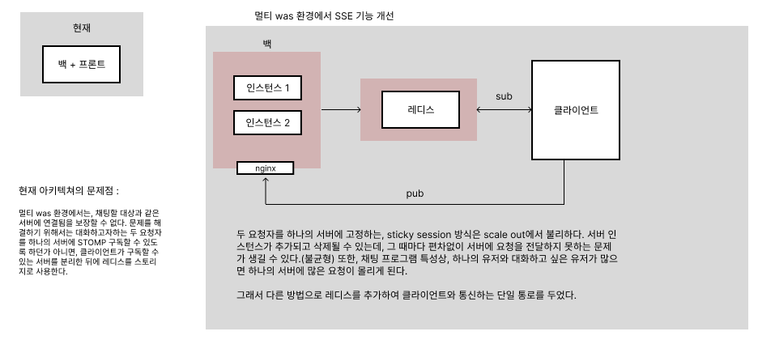
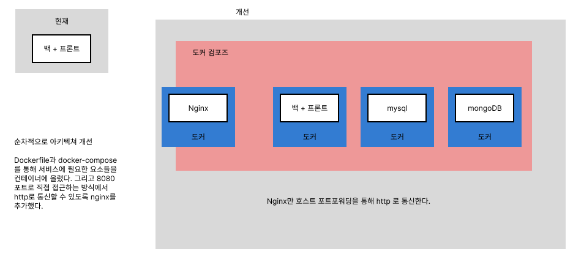
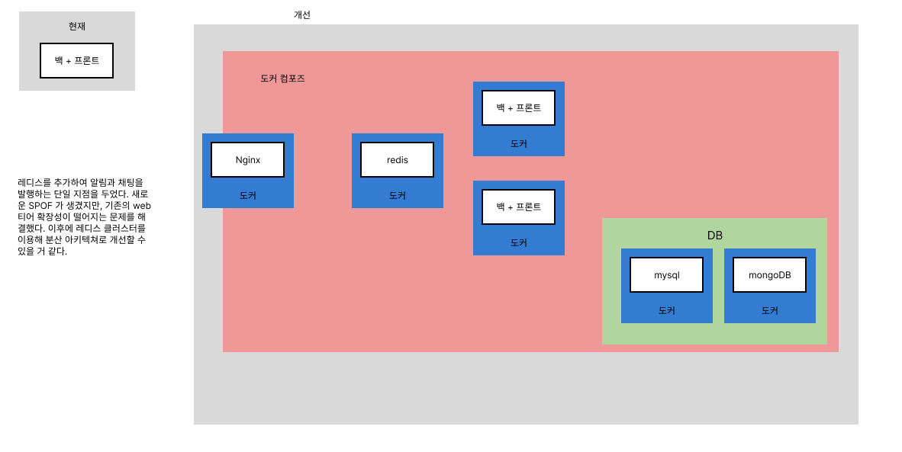

# Chat app

## How to run

- 채팅 메세지를 저장하는 데이터베이스가 mongodb를 사용하므로 mongodb와 연동해야한다.
- 기본 설정 포트로 실행한다면 별도의 설정없이 mongodb와 연동될 것이다.

```
source deploy.sh
```

### running with profile, dev
 
서버를 실행할 때마다 mongodb가 초기화되기를 원한다면(채팅 메세지 초기화), profile을 dev로 실행할 것.

## Video


https://github.com/user-attachments/assets/9a19c2bc-dc39-4f1b-86ea-72556c62d94e


## 아키텍쳐 개선




